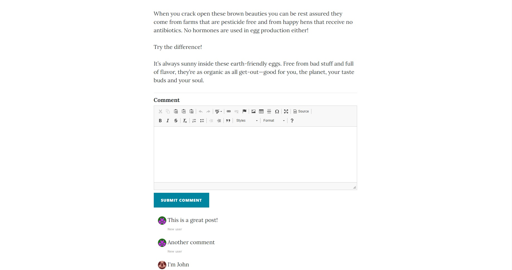
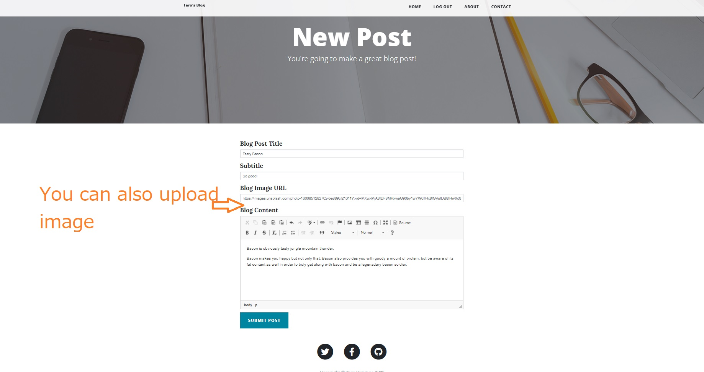
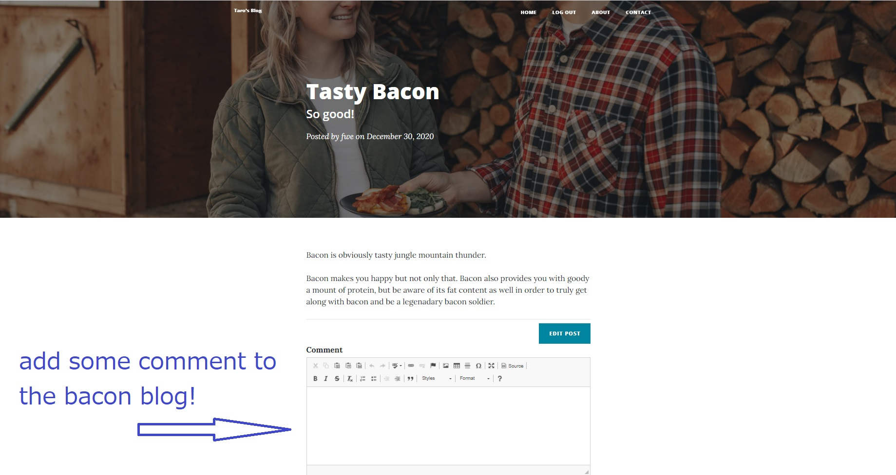

# Taro_Blog_Flask

## Interactive Flask blog app. 
### Python + Flask + Flask Mail + Postgre SQL + Werkzeug Encryption + Salting Password + Gravatar and more!

Try the working website here: https://flask-taro-blog-web.herokuapp.com/

## Register and write some blog!
#### Other people can also leave some comments to your post!

## Registration managed by PostGre SQL.
### Your password will be safely encrypted using Werkzeug hashing. ✌

yes
